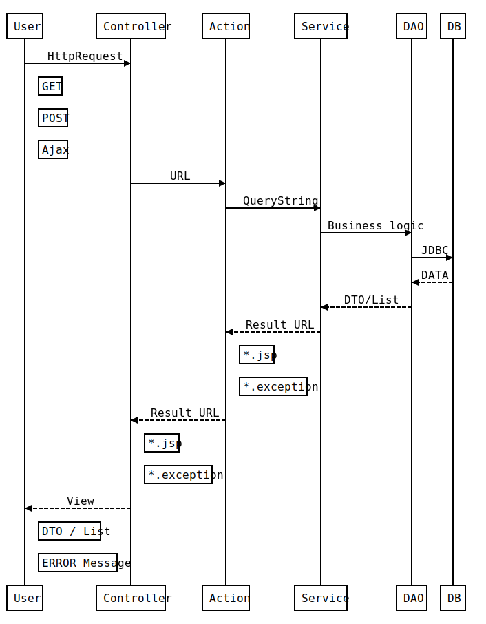

    

## 개요
- JSL인재개발원 내부 연수생 커뮤니티 시스템 
- 익명게시판, 장터기능, 정보공유, 회원간 쪽지 시스템, 실시간 알림 기능, 관리자페이지
- 개발기간 2017.08.27 ~ 2017.10.08 (43일)
- 커밋 107개

## 개발환경
- Java 1.8 / JSP, JSTL / Servlet / MVC2
- JDBC / MySQL 5.6
- Javascript / JQuery / Ajax
- Html / CSS3 / Bootstrap

## 라이브러리
Java (*.Jar)
  - Java Mail - 이메일 인증 시스템 및 비밀번호 찾기 기능
  - Spring Security Crypto - 사용자 비밀번호 BCrypt 암호화 적용 [4da1a90](https://github.com/10milin/JTalk/commit/4da1a902b488a5e26432ba9c17bdd99e696ae952) 
  - Cos - 사진 업로드 기능
  
Javascript (*.js)
  - pagination - 페이징 처리
  - summernote - 게시글 에디터
  - datepicker - 날짜 선택
  - inputmask - 데이터 입력포멧 제한
  - Chart - 관리자 페이지 차트 처리

## 뷰페이지 템플릿
- AdminLTE2

## 프로세스 설계  

## 주요 이슈
1. 중복 로그인 방지  
  HttpSessionBindingListener를 상속받아 싱글톤패턴(멀티스레드 동기화 이슈)의 [LoginManager](https://github.com/10milin/JTalk/blob/master/JTalk/src/com/jtalk/core/LoginManager.java)를 구현하여 WAS에서 HashMap으로 관리

2. 페이징 처리  
  Java단에서 한 페이지에 뿌려 줄 List를 추출하여 화면단에서 자바스크립트로 페이징 처리
  
3. 조회 수 중복 방지처리  
  쿠키를 활용하여 구현했으며 다음날 00시를 기준으로 남은 시간을 유효시간으로 처리
  
4. XSS 방어  
  Filter를 상속받아 [CrossScriptingFilter](https://github.com/10milin/JTalk/blob/master/JTalk/src/com/jtalk/security/CrossScriptingFilter.java)를 구현하여 [RequestWrapper](https://github.com/10milin/JTalk/blob/master/JTalk/src/com/jtalk/security/RequestWrapper.java)에서 문자열을 치환
  MultipartRequest의 경우 위의 필터와 별개로 처리되므로 [MultipartWrapper](https://github.com/10milin/JTalk/blob/master/JTalk/src/com/jtalk/security/MultipartWrapper.java)를 별도로 구현

5. 파일업로드 확장자 제한  
  [MultipartWrapper](https://github.com/10milin/JTalk/blob/master/JTalk/src/com/jtalk/security/MultipartWrapper.java)에서 허용되지 않은 확장자 파일이 업로드 될 경우 Exception 
